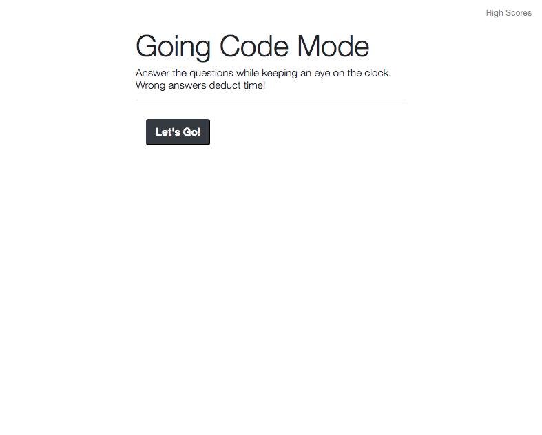
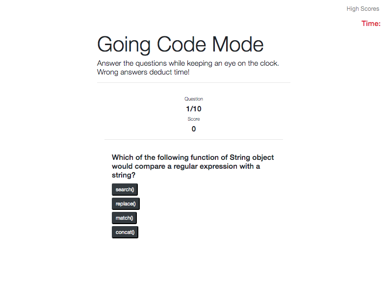
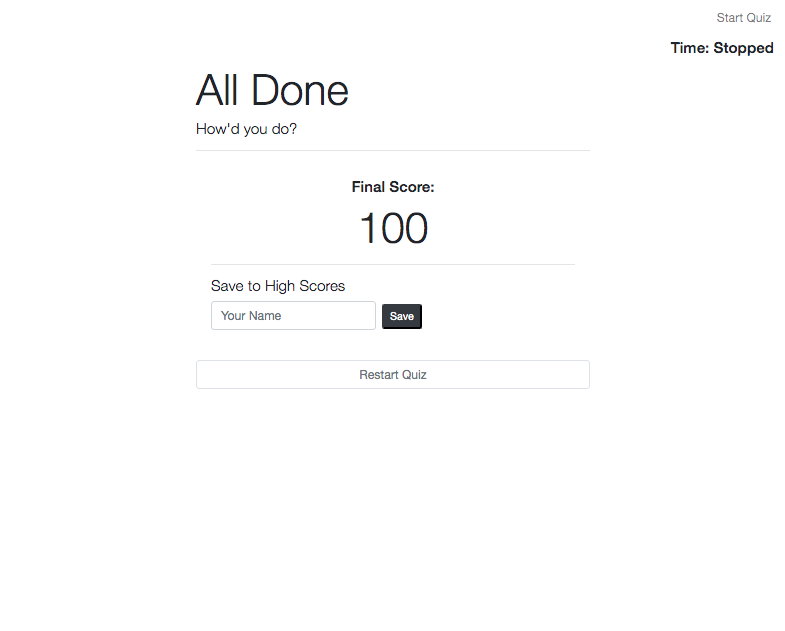
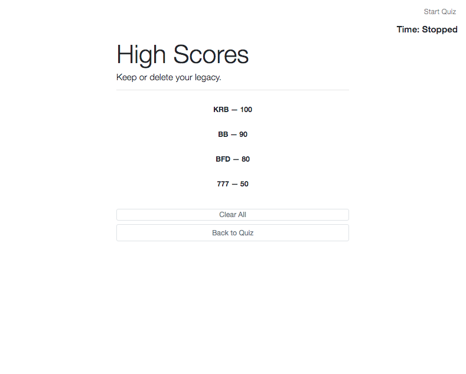

# JavaScript-Powered Coding Quiz ⏳

#### 📍 [View Deployment on GitHub Pages](https://katsign.github.io/code-quiz/) 📍

### A quick quiz game that puts your introductory programming knowledge to the test.

## *Table of Contents*

- [Description](#description)
- [Screenshots](#screenshots)
- [Approach](#approach)
- [Credits](#credits)
- [Contact](#contact)

## *Description*

This quiz game will take the user through 10 different questions about JavaScript coding methods. At the end, the user can save their score to the high scores log, or clear the existing entries. The main elements in play are click events, utilizing local storage and function syntax in JavaScript.

## *Screenshots*
Landing Page            |  Gameplay Format
:-------------------------:|:-------------------------:
  |  

User Input            |  High Scores
:-------------------------:|:-------------------------:
  |  

## *Approach*

Starting out writing full programs in JavaScript can be a very challenging endeavor — I used various online resources to help me along the way, which I have credited below. I spent a number of days just thinking about and sketching out my application and its pseudocode. I found that having a detailed list of what needed to appear on the page helped me research which methods I needed to familiarize myself with the most. Once I built out the skeleton API, I began to populate it with JavaScript. A majority of my time was spent troubleshooting with Live Server from the safety of my VS Code window.

## *Credits*

- I followed sections of [this fantastic quiz-building tutorial](https://github.com/jamesqquick/Build-A-Quiz-App-With-HTML-CSS-and-JavaScript) by James Q Quick to build out the gameplay for my web application.

- The CSS layout was made using [Bootstrap 4.0](https://getbootstrap.com) components, using direction from the [Bootstrap 4.0 Documentation](https://getbootstrap.com/docs/4.0/getting-started/introduction/).

- I pulled questions from [Geeks for Geeks](https://www.geeksforgeeks.org/javascript-quiz-set-1/) and [Tech Beamers](https://www.techbeamers.com/javascript-quiz-for-web-developers/) to populate my question array.

## *Contact*

🔗 Links in Bio @[katsign](https://github.com/katsign)

---
This project is MIT licensed. &copy; 2021
